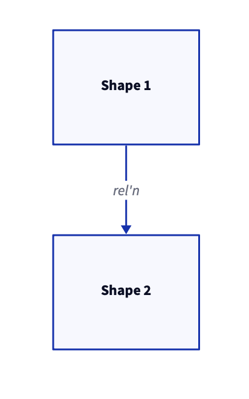
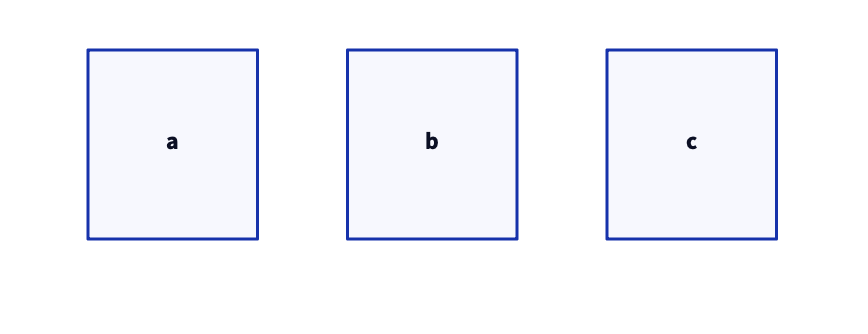
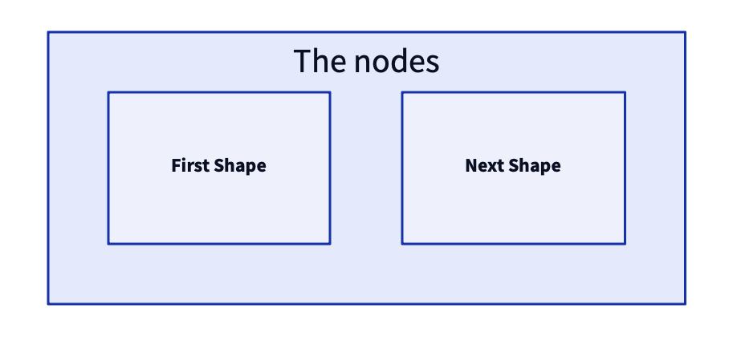

# Dictim

Dictim is a library for representing the [d2 language](https://github.com/terrastruct/d2) in Clojure/ Clojurescript. It uses vectors to represent d2 elements and maps and lists to represent an element's attributes.

## Release Information

Latest release:

[deps.edn](https://clojure.org/reference/deps_and_cli) dependency information:

As a git dep:

```clojure
io.github.judepayne/dictim {:git/tag "v0.1.0" :git/sha "8c93e0c"}
``` 


## Docs

* [Wiki](https://github.com/judepayne/dictim/wiki)


## Basic usage

### From dictim to d2

dictim and d2 have three different types of elements: shapes, connections and containers.

Here's an example of producing a d2 specifiction of a diagram with two shapes and a connection:

```clojure
user=> (use 'dictim.compiler)
nil
user=> (d2 [:s1 "Shape 1"] [:s2 {:label "Shape 2" :foo true}] [:s1 "->" :s2 {:label "rel'n"}])
"s1: Shape 1\ns2: {\n  label: Shape 2\n}\n\ns1 -> s2: {\n  label: rel'n\n}\n\n"
```

When sent to the d2 CLI executable:


The first element of an element is its key. Keys are important in d2. For example a connection between two shape must refer to each shape by its key.
As a shortcut, the label attribute can be specified in the second position in a shape (or the fourth position in a connection) rather than in the element's attribute map. d2 understands both ways.

Layout of shapes from a clojure collection:

```clojure
user=> (def nodes '(:a :b :c))
#'user/nodes
user=> (apply d2 (mapv (fn [n] [n (name n)]) nodes))
"a: a\nb: b\nc: c\n"
```



Container elements are like shapes but can nest any number of child elements at their end:

```clojure
user=> (d2 [:ctr1 "The nodes" [:a "First Shape"] [:n "Next Shape"]])
"ctr1: The nodes {\n  a: First Shape\n  n: Next Shape\n}\n"
```



For the full syntax, please see the [wiki](https://github.com/judepayne/dictim/wiki).


### From d2 to dictim


*TBD*


## Licsense

Copyright © 2023 Jude Payne

Distributed under the [MIT License](http://opensource.org/licenses/MIT)
