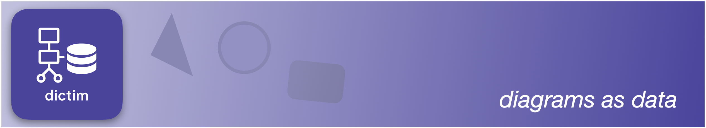
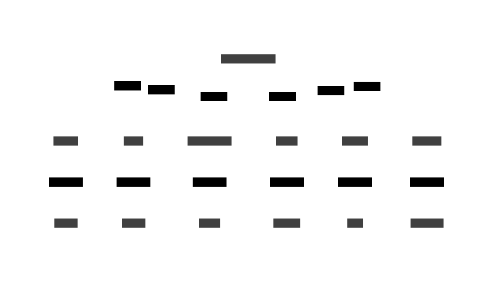
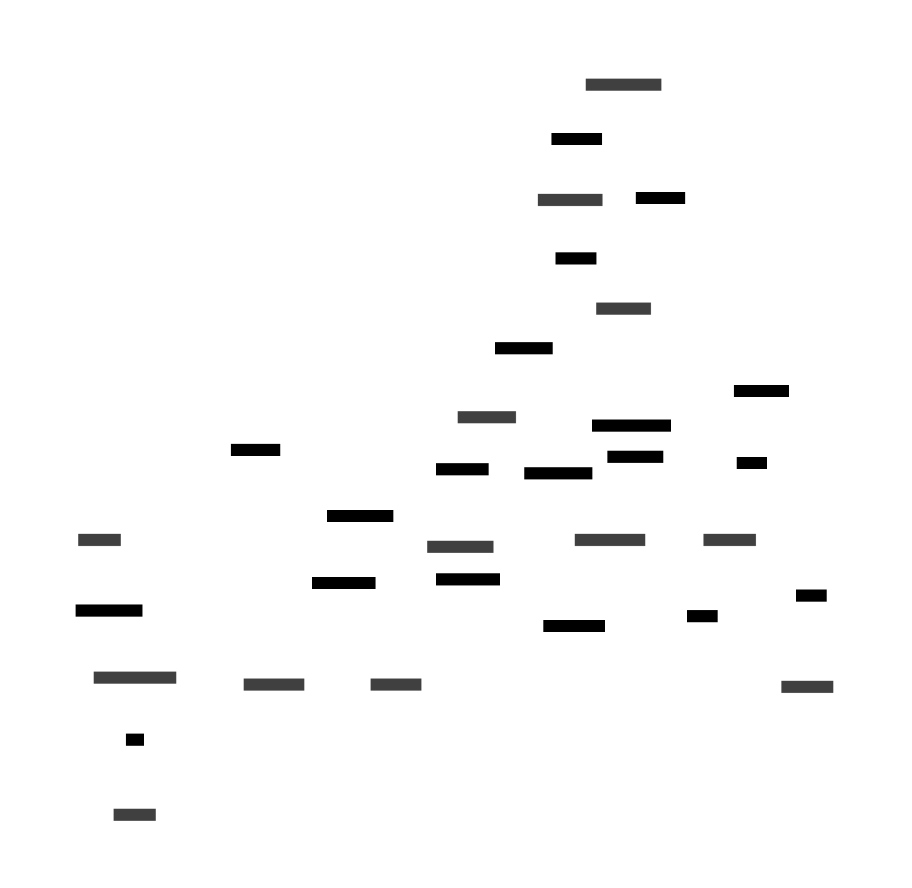
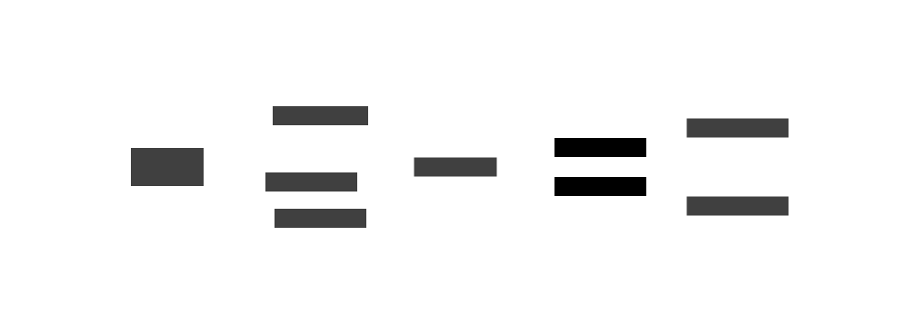
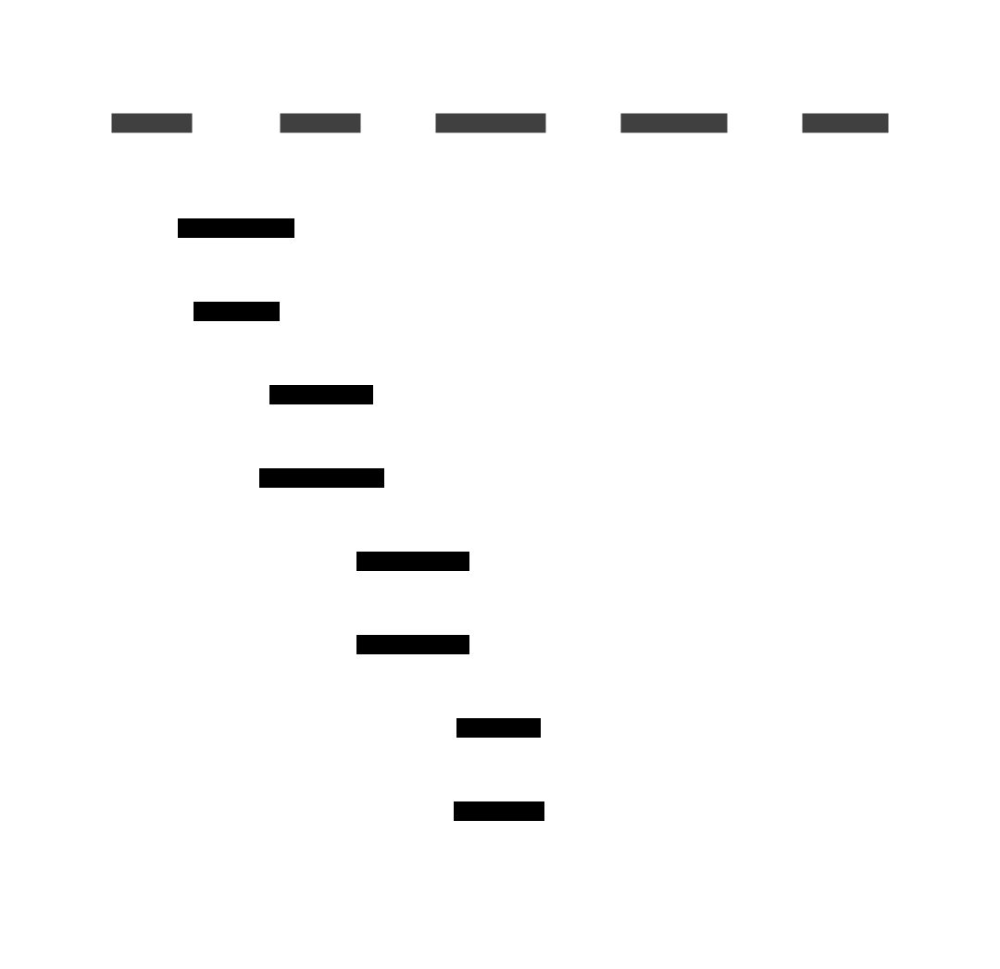

<div align="center">



[Wiki](https://github.com/judepayne/dictim/wiki)

CI [](https://dl.circleci.com/status-badge/redirect/gh/judepayne/dictim/tree/main)
Release [](https://github.com/judepayne/dictim/releases)
License [](https://opensource.org/licenses/MIT)
<small>d2 compatibility: **0.7.0**</small>

</div>

# dictim

#### **d2's datafied companion**

The dictim project is both a command line tool and clojure library that leverage the underlying power of d2 to transform your data into diagrams.

The command line tool (**dict**) converts structured data into [d2]((https://d2lang.com)) or beautiful diagrams directly. Generate diagrams from json or [edn](https://github.com/edn-format/edn), parse existing d2 back into data, and automate diagram creation in your workflows.


```bash
# Transform data into a diagram in seconds with the '--image' option

dict -i '["app" "Web App"]["db" "Database"] \
         ["app" "->" "db" "queries"]' > diagram.svg
```


## Why dict?

### 🚀 **Diagrams as Data**
Generate diagrams programmatically from your data. No more manually updating diagrams when your architecture changes.

### ⚡ **Lightning Fast**
Native binaries for macOS, Linux, and Windows. No JVM startup time, no dependencies.

### 🔄 **Round-trip Compatible** 
Parse existing d2 diagrams back into structured data for analysis, transformation, or migration.

### 🛠 **CI/CD Ready**
Perfect for documentation pipelines, automated architecture diagrams, and keeping visual documentation in sync with code.

## Quick Start

### Installation

**macOS (Homebrew)**
```bash
brew install judepayne/tap/dictim
```

**Windows (Scoop)**
```bash
scoop bucket add judepayne https://github.com/judepayne/scoop-judepayne
scoop install dictim
```

Note: d2 is installed as a dependency by Homebrew, but is not available on Scoop, so please install it as per the [instructions](https://github.com/terrastruct/d2/blob/master/docs/INSTALL.md).

**Linux/Manual Installation**
```bash
# Download from releases (amd64)
wget https://github.com/judepayne/dictim/releases/latest/download/dict-linux-amd64
chmod +x dict-linux-amd64
sudo mv dict-linux-amd64 /usr/local/bin/dict

# Or for ARM64
wget https://github.com/judepayne/dictim/releases/latest/download/dict-linux-arm64
chmod +x dict-linux-arm64
sudo mv dict-linux-arm64 /usr/local/bin/dict
```

**Other Platforms**

As a babashka uberjar with bbin, please see the [Wiki](https://github.com/judepayne/dictim/wiki) page.


*or*

download the appropriate release and put on your path.

Check the [releases page](https://github.com/judepayne/dictim/releases/latest) if none of these options work for you.

### Your First Diagram

Create a simple json file:
```bash
echo '[
  ["user", "User", {"shape": "person"}],
  ["system", "System", {"shape": "rectangle"}], 
  ["user", "->", "system", "interacts", {"style.stroke": "blue"}]
]' > simple.json
```

Transform it to d2:
```bash
dict -c simple.json
```

**Output:**
```d2
user: User {shape: person}
system: System {shape: rectangle}
user -> system: interacts {style.stroke: blue}
```

Render with d2:
```bash
dict -c < simple.json | d2 - simple.svg
```

Or just directly:
```bash
dict -i < simple.json > simple.svg
```

## Real-World Examples

### Transforming data from a REST API

```bash
# Try this now!
curl -s "https://restcountries.com/v3.1/region/europe?fields=name,capital" | \
  jq -r '.[0:6] | map({country: .name.common, capital: (.capital // ["Unknown"])[0]}) | 
         [["Europe", "European Region"]] + 
         (map([.country, .country])) + 
         (map([.capital, .capital])) + 
         (map(["Europe", "->", .country, "contains"])) + 
         (map([.country, "->", .capital, "capital city"])) | @json' | \
  dict -i > europe.svg && open europe.svg
```

<div style="text-align: center;">
<div style="width: 900px; margin: 0 auto;">



</div>
</div>

> [!Tip]
> Point your AI tool to the dictim syntax [page](https://github.com/judepayne/dictim/wiki/dictim-syntax) and the command line [page](https://github.com/judepayne/dictim/wiki/Command-Line) and it should do great at authoring these little transformer scripts, jq statements.
> Build up a library!

### System architecture

**edn**
```edn
[["frontend" "React Frontend" {"shape" "rectangle"}]
 ["api" "REST API" {"shape" "hexagon"}]
 ["cache" "Redis Cache" {"shape" "cylinder"}]
 ["database" "PostgreSQL" {"shape" "cylinder"}]
 ["frontend" "->" "api" "HTTP requests"]
 ["api" "->" "cache" "cache lookup"]
 ["api" "->" "database" "SQL queries"]]
```


### DevOps Pipeline

Generate deployment diagram from kubernetes infrastructure:
```bash
kubectl get services -o json | jq -r '
  .items | map([.metadata.name, .spec.type]) | @json
' | dict -i > deployment.svg
```

**Advanced: Comprehensive microservices architecture**

**infrastructure.json**
```json
[
  ["nginx-ingress", "Ingress Controller", {"shape": "diamond"}],
  ["frontend-service", "React Frontend", {"shape": "rectangle"}],
  ["api-gateway", "API Gateway", {"shape": "hexagon"}],
  ["user-service", "User Service", {"shape": "rectangle"}],
  ["order-service", "Order Service", {"shape": "rectangle"}],
  ["payment-service", "Payment Service", {"shape": "rectangle"}],
  ["notification-service", "Notification Service", {"shape": "rectangle"}],
  ["user-db", "User Database", {"shape": "cylinder"}],
  ["order-db", "Order Database", {"shape": "cylinder"}],
  ["redis-cache", "Redis Cache", {"shape": "cylinder"}],
  ["message-queue", "RabbitMQ", {"shape": "queue"}],
  ["monitoring", "Prometheus", {"shape": "cloud"}],
  ["logging", "ELK Stack", {"shape": "cloud"}],
  ["nginx-ingress", "->", "frontend-service", "routes traffic"],
  ["nginx-ingress", "->", "api-gateway", "API requests"],
  ["frontend-service", "->", "api-gateway", "AJAX calls"],
  ["api-gateway", "->", "user-service", "authenticates"],
  ["api-gateway", "->", "order-service", "order requests"],
  ["api-gateway", "->", "payment-service", "payment processing"],
  ["order-service", "->", "user-service", "validates user"],
  ["order-service", "->", "payment-service", "process payment"],
  ["payment-service", "->", "notification-service", "payment events"],
  ["order-service", "->", "message-queue", "order events"],
  ["notification-service", "<-", "message-queue", "consumes events"],
  ["user-service", "->", "user-db", "stores user data"],
  ["order-service", "->", "order-db", "stores orders"],
  ["user-service", "->", "redis-cache", "caches sessions"],
  ["order-service", "->", "redis-cache", "caches inventory"],
  ["user-service", "->", "monitoring", "metrics"],
  ["order-service", "->", "monitoring", "metrics"],
  ["payment-service", "->", "monitoring", "metrics"],
  ["notification-service", "->", "logging", "logs"]
]
```

Generate an infrastructure diagram:
```bash
dict -i --theme 3 < infrastructure.json > devops-pipeline.svg
```




### Git Branch Analysis

Use a [babashka](https://babashka.org) script to transform git output..

**git-dict.bb**
```clojure
#!/usr/bin/env bb
(require '[cheshire.core :as json]
         '[clojure.string :as str])

(let [branches (->> (slurp *in*) str/split-lines)
      clean-branches (map #(-> % str/trim (str/replace #"origin/" "")) branches)
      main-branch "main"
      
      ;; Create branch nodes
      branch-nodes (for [branch clean-branches
                         :when (not= branch "HEAD")]
                     (if (= branch main-branch)
                       [branch "Main Branch" {"shape" "hexagon"}]
                       [branch "Feature Branch" {"shape" "rectangle"}]))
      
      ;; Create connections from main to feature branches
      connections (for [branch clean-branches
                        :when (and (not= branch "HEAD") 
                                   (not= branch main-branch))]
                    [main-branch "->" branch "branched from"])
      
      dictim-data (concat '({"direction" "right"}) branch-nodes connections)]
  (println (json/generate-string dictim-data)))
```

Generate a branch visualization:
```bash
git branch -r | bb git-to-dictim.bb | dict -c | d2 - branches.svg
```



### Database Schema
```edn
[["objects"
  {"shape" "sql_table"}
  ["id" "int" {"constraint" "primary_key"}]
  ["disk" "int" {"constraint" "foreign_key"}]
  ["json" "jsonb" {"constraint" "unique"}]
  ["last_updated" "timestamp with time zone"]]
 ["disks"
  {"shape" "sql_table"}
  ["id" "int" {"constraint" "primary_key"}]]
 ["objects.disk" "->" "disks.id"]]
```


### Distributed Tracing Sequence Diagrams

Visualize microservice interactions from Jaeger trace data using a babashka script:

**jaeger-to-sequence.bb**
```clojure
#!/usr/bin/env bb
(require '[cheshire.core :as json])

(let [jaeger-data (json/parse-string (slurp *in*))
      spans (get-in jaeger-data ["data" 0 "spans"])
      span-map (into {} (map #(vector (get % "spanID") %) spans))
      services (distinct (map #(get-in % ["process" "serviceName"]) spans))
      service-declarations (map #(vector % {"shape" "sequence_diagram"}) services)
      
      interactions
      (for [span spans
            :let [references (get span "references" [])]
            ref references
            :when (= "CHILD_OF" (get ref "refType"))
            :let [parent-span-id (get ref "spanID")
                  parent-span (get span-map parent-span-id)
                  parent-service (get-in parent-span ["process" "serviceName"])
                  child-service (get-in span ["process" "serviceName"])
                  operation (get span "operationName")]]
        [parent-service "->" child-service operation])
      
      ;; Combine sequence diagram declaration, service declarations and interactions  
      dictim-data (concat [["shape" "sequence_diagram"]] service-declarations interactions)]
  (println (json/generate-string dictim-data)))
```

Generate the sequence diagram:

```bash
curl "http://jaeger:16686/api/traces?service=api-gateway&limit=1" | \
  bb jaeger-to-sequence.bb | \
  dict -c | d2 --layout elk - trace.svg
```



### d2 Conversion

Convert existing D2 diagrams to structured data for version control and programmatic manipulation:

**api-system.d2**
```d2
direction: right

# Three-tier architecture
frontend: Web Frontend {
  shape: rectangle
  style.fill: "#87CEEB"
}

api: REST API {
  shape: hexagon
  style.fill: "#98FB98"
}

database: PostgreSQL {
  shape: cylinder
  style.fill: "#FFB6C1"
}

# External user
user: User {shape: person}

# Relationships
user -> frontend: Browser requests
frontend -> api: AJAX calls
api -> database: SQL queries
```

Parse to structured data:
```bash
dict -p api-system.d2 > system.edn
```

**Output: system.edn**
```edn
({"direction" "right"}
 ["frontend" "Web Frontend" {"shape" "rectangle" "style.fill" "#87CEEB"}]
 ["api" "REST API" {"shape" "hexagon" "style.fill" "#98FB98"}]
 ["database" "PostgreSQL" {"shape" "cylinder" "style.fill" "#FFB6C1"}]
 ["user" "User" {"shape" "person"}]
 ["user" "->" "frontend" "Browser requests"]
 ["frontend" "->" "api" "AJAX calls"]
 ["api" "->" "database" "SQL queries"])
```

Now you can version control the structured data, apply programmatic transformations, or generate variations:

```bash
# Regenerate the diagram
dict -i --theme 4 < system.edn -o updated-system.svg

# Apply a corporate template  
dict -i -t corporate-styles.edn < system.edn -o branded-diagram.svg
```

## Commands

| Command | Description | Example |
|---------|-------------|---------|
| `-c, --compile` | Transform data to D2 | `dict -c data.json` |
| `-i, --image` | Transform data directly to SVG diagram | `dict -i < data.json > diagram.svg` |
| `-p, --parse` | Parse D2 to structured data | `dict -p diagram.d2` |
| `-h, --help` | Display help information | `dict --help` |

**Bundled Options:**

| Command | Description | Equivalent |
|---------|-------------|------------|
| `-cw` | Compile and watch | `-c -w` |
| `-pw` | Parse and watch | `-p -w` |
| `-iw` | Image and watch | `-i -w` |
| `-aw` | Apply template and watch | `-a -w` |

*(and many other [commands](https://github.com/judepayne/dictim/wiki/Command-Line))*

## Advanced Usage

### Watch Mode for Development
```bash
# Auto-regenerate diagram when data changes
dict -cw architecture.json -o arch.d2
# Or using separate flags:
dict -c -w architecture.json -o arch.d2

# Watch and serve the diagram in browser (requires d2)
dict -iw architecture.json
```

### Templates and Theming
```bash
# Apply consistent styling across diagrams
dict -c -t corporate-theme.edn system-data.json
```

### Integration with CI/CD
```yaml
# GitHub Actions example
- name: Generate Architecture Diagrams
  run: |
    dict -c infrastructure.json | d2 - docs/architecture.svg
    git add docs/architecture.svg
```

## Data Format

'dictim syntax' is a datafied version of d2 that stays close to its syntax. It can be either **json** or **edn** and is easy to learn:

**[edn](https://github.com/edn-format/edn)**


```edn
;; basic shapes and connections
(
[:z]
["a" "A shape"]
["b" "B shape"]
["a" "<->" "b"]
[:z "->" "b" "->" "a" "connection lbl"]

;; shapes can be nested: 'containers'
["ctr" "Group" ["c1" "Aria"]["c2" "Rames"]]

;; everthing can be styled with attributes
[:z "Obj Store" {:shape :cloud :style.fill "red"}]
["a" "<->" "b" "order flows" {"style" (:stroke-dash 5)}]
)
```

**json**

```json
[
  ["z"],
  ["a", "A shape"],
  ["b", "B shape"],
  ["a", "<->", "b"],
  ["z", "->", "b", "->", "a", "connection lbl"],
  ["ctr", "Group", ["c1", "Aria"], ["c2", "Rames"]],
  ["z", "Obj Store", {"shape": "cloud", "style.fill": "red"}],
  ["a", "<->", "b", "order flows", {"style": {"stroke-dash": 5}}]
]
```

See the [wiki](https://github.com/judepayne/dictim/wiki/dictim-syntax) page for the full syntax.

## Documentation

- **[Complete Guide](https://github.com/judepayne/dictim/wiki)** - Comprehensive documentation
- **[CLI Reference](https://github.com/judepayne/dictim/wiki/Command-Line)** - All command options
- **[Data Format](https://github.com/judepayne/dictim/wiki/Dictim-Syntax)** - Syntax specification
- **[Templates](https://github.com/judepayne/dictim/wiki/Templates)** - Styling and theming
- **[Examples](https://github.com/judepayne/dictim.cookbook)** - Real-world use cases


## Use as a Clojure/ Babashka library in your app

[](https://book.babashka.org#badges)

dict is built on the **dictim** Clojure library. If you're building Clojure applications, you can use dictim directly:

```clojure
;; deps.edn
{:deps {io.github.judepayne/dictim {:git/tag "0.9.3" :git/sha "c0b5cec"}}}
```

**Example Use:**

```clojure
(require '[dictim.d2.compile :as d2])

(d2/d2 [["app" "Web App"] 
        ["db" "Database"]
        ["app" "->" "db" "queries"]])
;; => "app: Web App\ndb: Database\napp -> db: queries"
```

See the [Wiki](https://github.com/judepayne/dictim/wiki) for more details.

### Related Projects

- **[dictim.graph](https://github.com/judepayne/dictim.graph)** - Convert graph data structures
- **[dictim.cookbook](https://github.com/judepayne/dictim.cookbook)** - Example diagrams and patterns  
- **[dictim.server](https://github.com/judepayne/dictim.server)** - HTTP API microservice

See the **[API Documentation](https://github.com/judepayne/dictim/wiki/API-Reference)** for complete library usage.


## License

Copyright © 2025 Jude Payne

Distributed under the [MIT License](http://opensource.org/licenses/MIT)
